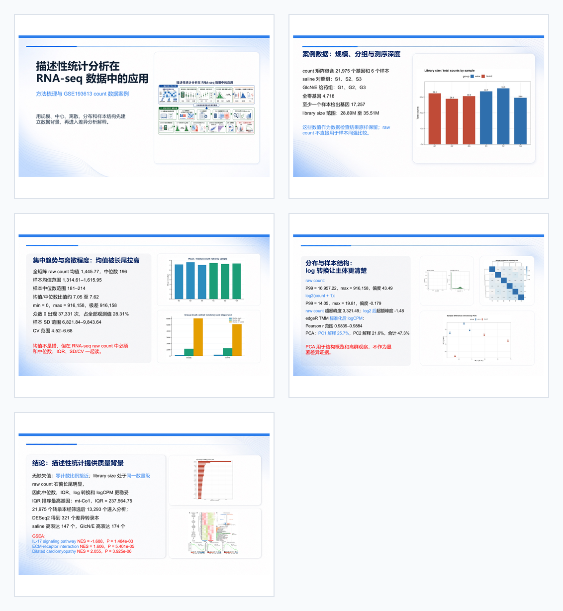

<p align="center">
  
</p>

# Image2Slides

**Languages:** English | [中文](./README.zh-CN.md) | [日本語](./README.ja.md)

Image2Slides is a Codex plugin and CLI workflow for turning GPT-image slide visuals into editable PowerPoint decks. It uses Codex native `image_gen` for GPT-image-2 visual bases, keeps source-locked data figures exact, places editable PowerPoint text above matched backgrounds, and verifies the final deck against reference images.

The plugin entrypoint is `/image2slides`, implemented by [skills/image2slides/SKILL.md](./skills/image2slides/SKILL.md). The deterministic helper CLI is [skills/image2slides/scripts/image2slides.py](./skills/image2slides/scripts/image2slides.py).

## Install

This repository is installable through npm directly from GitHub:

```bash
npm install -g git+https://github.com/Starry-49/image2slides.git
image2slides doctor
```

Codex local plugin deployment has two practical paths:

1. Self-install from a checked-out repo:

   ```bash
   git clone https://github.com/Starry-49/image2slides.git
   cd image2slides
   npm install -g .
   npm pack
   mkdir -p ~/.codex/plugins/cache/image2slides-local/image2slides
   rm -rf ~/.codex/plugins/cache/image2slides-local/image2slides/1.0.0
   mkdir -p ~/.codex/plugins/cache/image2slides-local/image2slides/1.0.0
   tar -xzf image2slides-1.0.0.tgz \
     -C ~/.codex/plugins/cache/image2slides-local/image2slides/1.0.0 \
     --strip-components=1
   rm image2slides-1.0.0.tgz
   image2slides doctor
   ```

   Then restart or refresh Codex so the local plugin cache is re-indexed. The plugin manifest is `.codex-plugin/plugin.json`; the slash-command skill is `skills/image2slides/SKILL.md`.

2. Ask Codex to install it:

   ```text
   Install or refresh the local Codex plugin from /path/to/image2slides.
   Use .codex-plugin/plugin.json as the manifest, enable the Image2Slides plugin,
   then run `image2slides doctor` and confirm `/image2slides` is available.
   ```

   If the app asks for a path, point it at the repository root, not the `skills/` subdirectory.

For local development:

```bash
git clone https://github.com/Starry-49/image2slides.git
cd image2slides
PYTHONPATH=skills/image2slides/scripts python3 tests/test_image2slides.py
python3 skills/image2slides/scripts/image2slides.py doctor
```

Default GPT-image-2 execution uses Codex native `image_gen` and does not require `OPENAI_API_KEY`. The OpenAI SDK/API-key CLI path is an optional fallback only when you explicitly want API/SDK execution outside the native Codex imagegen path.

## Required User Inputs

`/image2slides` requires all of these fields before generation starts:

- slide base style and color tone
- slide aspect ratio
- slide page count
- slide purpose: speech or showcase
- presentation scene: academic, enterprise, classroom, life, or another explicit scene
- knowledge base: user-provided text, images, references, or material paths

Use [examples/spec.example.json](./examples/spec.example.json) as the starting shape.

## Workflow To Results

1. Create the project wiki and output structure:

   ```bash
   image2slides init --project decks/my-deck --spec examples/spec.example.json
   ```

   This writes `project.json`, `wiki/00_project_brief.md`, `wiki/01_wiki_map.md`, `wiki/02_content_boundary.md`, `wiki/03_source_registry.yml`, and `wiki/04_slide_plan.json`.

2. Fill the knowledge boundary:

   - Put sourced facts, citations, extracted text, and web/search findings in `wiki/grep/`.
   - Put generated narrative, metaphors, teaching examples, and draft phrasing in `wiki/generate/`.
   - Update `wiki/02_content_boundary.md` so every slide says what must be grep/search grounded and what can be generated.

3. Write image prompts:

   ```bash
   image2slides queue --project decks/my-deck
   ```

   Results:
   - `prompts/completed_prompts.jsonl`
   - `prompts/background_edit_prompts.jsonl`

   `queue` first normalizes source-layer panels so each panel bbox follows the trimmed source figure aspect ratio plus the configured inset margin. You can check or apply that step explicitly with:

   ```bash
   image2slides normalize-source-panels --project decks/my-deck --check --strict
   image2slides normalize-source-panels --project decks/my-deck
   ```

4. Generate GPT-image-2 completed slide references with Codex native `image_gen`.

   The default plugin workflow uses Codex native image generation, so it does not require `OPENAI_API_KEY`. Each `completed/slide_XX_completed.png` must be a GPT-image-2 full-slide reference with the intended visible text. Never fill `completed/` from PPTX/PDF renders, local screenshots, or deterministic drawing output. After copying native image_gen outputs into `completed/`, register them:

   ```bash
   image2slides register-completed --project decks/my-deck
   ```

5. Generate text-free backgrounds by editing each completed slide.

   The background pass uses GPT-image-2 edit and removes only text, keeping layout, graphics, color, and geometry aligned with `completed/`. After native image_gen edit outputs are copied into `background/`, register them so downstream steps can prove they are text-free edits of the current completed batch:

   ```bash
   image2slides imagegen --project decks/my-deck --phase background --dry-run
   image2slides imagegen --project decks/my-deck --phase background --execute
   image2slides register-background --project decks/my-deck
   ```

   For source-locked data/results, keep original figures in `wiki/sources/` and patch exact trimmed source figures into the existing image_gen completed/background pair:

   ```bash
   image2slides compose-source-locked --project decks/my-deck
   image2slides audit-layout --project decks/my-deck --strict
   ```

   Results land in `background/slide_XX_background.png` plus `background/.image2slides_background_provenance.json`. The background prompt requires the only difference from `completed/` to be removed text; layout, graphics, color, and geometry must remain aligned. `analyze`, `build-pptx`, `compose-source-locked`, and `qa` reject unregistered local templates, screenshots, deterministic drawings, stale backgrounds, or background batches not tied to the current completed provenance.
   The layout audit verifies that source figures stay inside detected/native panels, panel inset ratios match trimmed source figure ratios, source panels/images do not overlap each other or editable text, figure-first slides keep figures visually dominant over supporting text, and duplicate rounded frames are not added over native imagegen panels.
   Source fitting trims blank pixels, asks GPT-image-2 to reserve panels whose proportions match source images, detects the actual panel edge on generated bases or backgrounds, insets that panel by `fit_margin_px`, maximizes scale under the four parallel-edge constraints, then center-aligns the image inside that inset panel. Generated/native panels enforce at least 32 px of inset margin even if a layer asks for less, and edge-connected near-white source blank is pasted transparently so a chart cannot cover the generated panel with its own white rectangle. The planned `bbox` is only a detector search hint; if it points at a wrong insertion position, Image2Slides must still use the true generated panel or fail strict QA. If the true generated panel ratio does not match the trimmed source ratio, regenerate the GPT-image-2 panel instead of stretching or cropping the source.
   `queue` also writes each source panel into `wiki/04_slide_plan.json` as a `non_editable_image_panel` layout boundary. Editable PowerPoint text should never be placed inside these regions. Text already printed inside source charts, diagrams, schematics, or icons is treated as image content and is preserved unless the user explicitly asks to extract it.

   Figure-first standard:
   - keep exact source panels for result/data figures whose plotted values must remain unchanged
   - do not reserve panels for decorative diagrams, icons, or text-heavy screenshots when their text can be extracted
   - use less text; text should explain how to read the figure, not compete with it
   - split crowded multi-figure messages into more slides instead of shrinking every figure

   Optional API/SDK fallback for completed generation is available only when explicitly requested:

   ```bash
   image2slides imagegen --project decks/my-deck --phase completed --dry-run
   image2slides imagegen --project decks/my-deck --phase completed --execute
   ```

6. Analyze text and blank regions:

   ```bash
   image2slides analyze --project decks/my-deck
   ```

   Results:
   - `analysis/slide_XX.json`
   - `analysis/manifest.json`

   The analyzer compares `completed/` and `background/`, treats their pixel difference as the text mask, identifies dominant background colors, estimates text regions, and finds low-variation blank regions for editable text filling.
   Before trusting that mask as a correction target, review whether the completed/background pair differs only by text. If non-text geometry, panels, figures, or illustrations moved, regenerate the GPT-image-2 background edit rather than tuning PPT text around a contaminated mask.

7. Build the editable PowerPoint deck:

   ```bash
   image2slides build-pptx --project decks/my-deck
   ```

   Result:
   - `pptx/image2slides.pptx`

   Every slide uses the matching background image as the non-editable visual base. Text from `wiki/04_slide_plan.json` is added as editable PowerPoint text boxes above the background.

8. Render and verify:

   ```bash
   image2slides qa --project decks/my-deck --strict
   ```

   Results:
   - `reports/rendered/`
   - `reports/qa_similarity.json`
   - `reports/qa_report.md`
   - `reports/source_layer_audit.md`
   - `reports/text_alignment_audit.md`
   - `reports/source_render_audit.md`
   - `reports/background_audit.md`
   - `reports/content_boundary_audit.md`
   - `reports/content_boundary_overlays/`

   QA re-renders the PPTX locally when LibreOffice and `pdftoppm` are available, compares rendered slides with `completed/` using pixel and patch similarity, repeats the fixed source-layer layout audit, checks each rendered source crop against the final source-locked background crop, verifies source transparent blank still matches the source-free native panel, checks local editable-text alignment against `completed/`, and fails strict mode on byte-identical or visually near-identical background pages. The default strict similarity preset requires overall pixel similarity >= 0.90 while allowing expected font rasterization differences between GPT-image-2 reference text and editable PowerPoint text. Stale rendered screenshots are cleared before each render.
   The content-boundary audit is the stronger diagnostic for layout confidence: it detects the main blank color, defines `blank_zone`, `forbidden_zone`, and `text_fill_zone`, treats source panels as no-text regions, excludes asset-internal labels inside images, and writes visual overlays for Codex/LLM review. Use `image2slides audit-boundaries --project decks/my-deck --rendered-dir reports/rendered` when you want to run that diagnostic independently. Add `--boundary-strict` to `qa` only when these warnings should fail the command.

If a stage deviates from this order, delete every downstream artifact from the first invalid stage and restart from the last valid checkpoint. For example, invalid `completed/` means rerun completed, background, analysis, PPTX, and QA; invalid `background/` means rerun background, analysis, PPTX, and QA.

9. Do a brief human detail check.

   Open `pptx/image2slides.pptx` and scan for the small details that automated QA should not overfit: figure-panel visual padding, line breaks, font scale, obvious text overflow, page-to-page consistency, and whether source data/results remain unchanged. Keep this as a short final review pass after strict QA, not as a replacement for QA.

## Howitworks Example

The repository includes [howitworks/](./howitworks/) as a minimal mental model of the full workflow. It contains the knowledge-base document, extracted text and figures, structured wiki, GPT-image-2 native bases, source-locked completed/background images, final PPTX, rendered slides, QA reports, and a short example README.



The main editable result is [howitworks/image2slides_run/pptx/image2slides.pptx](./howitworks/image2slides_run/pptx/image2slides.pptx). The human-reviewed visual export is [howitworks/image2slides_run/pptx/image2slides.pdf](./howitworks/image2slides_run/pptx/image2slides.pdf); prefer that PDF for final visual inspection because it comes directly from the reviewed PowerPoint deck and avoids later conversion drift. The npm package stays lightweight and does not include this large example artifact set; clone the GitHub repo when you want to inspect or rerun the example.

## Output Directory Map

```text
decks/my-deck/
├── project.json
├── wiki/
│   ├── grep/
│   ├── generate/
│   ├── 02_content_boundary.md
│   └── 04_slide_plan.json
├── prompts/
├── completed/
├── background/
├── analysis/
├── pptx/
└── reports/
```

## Design Boundary

Image2Slides intentionally does not make the final deck image-only. Full-slide images are visual references and QA targets. The final result keeps important text editable in PowerPoint, using text-free image backgrounds as stable base layers.
